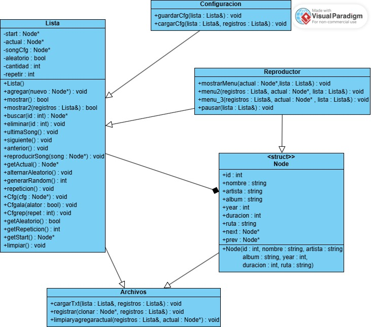

# Nombre personalizado67

## Integrantes

- Francisco Castillo
- Benjamin Torres

---

## Descripcion

Este es un reproductor de musica desarrollado en c++, simula un reproductor leyendo un archivo local e implementa una lista enlazada para recorrer las distintas canciones de forma eficiente. Entre las funciones incluidas se encuentra pausar/despausar una cancion, activar/desactivar un modo de siguiente cancion aleatoria, alternar si se quiere activar repeticion de canciones, etc. Al finalizar el programa los datos se guardan en un archivo "status.cfg" para retomar el progreso despues.

---

## Diagrama de clases

---

## Instrucciones de compilacion

1. Ir a hasta la carpeta donde se encuentra main desde el explorador de archivos
2. Copiar la ruta y abrir la consola del sistema
3. En el cmd escribir "cd " y pegar la ruta del archivo
4. copiar y pegar "g++ main.cpp data_structures/Node.cpp data_structures/Lista.cpp core/reproductor.cpp core/configuracion.cpp core/archivos.cpp -o reproductor"

---

## Funciones

- `W` -> Reproducir / Pausar
- `Q` -> Pista anterior
- `E` -> Pista siguiente
- `S` -> Activar / Desactivar modo aleatorio
- `R` -> Repetición (Desactivado/Repetir una/Repetir todas)
- `A` -> Ver lista de reproducción actual
- `L` -> Listado de canciones
- `X` -> Salir

Opciones del menu "a"
- `S<num>` -> Salta a la cancion en la posicion de num
- `V` -> Cierra el submenu y vuelve al principal

Opciones del menu "l"

- `R<num>` -> Reproduce la cancion seleccionada
- `A<num>` -> Agrega la cancion al final de la lista
- `N` -> Agrega la cancion al registro
- `D<num>` -> Eliminar la cancion el posicion num
- `V` -> Cierra el submenu y vuelve al principal
